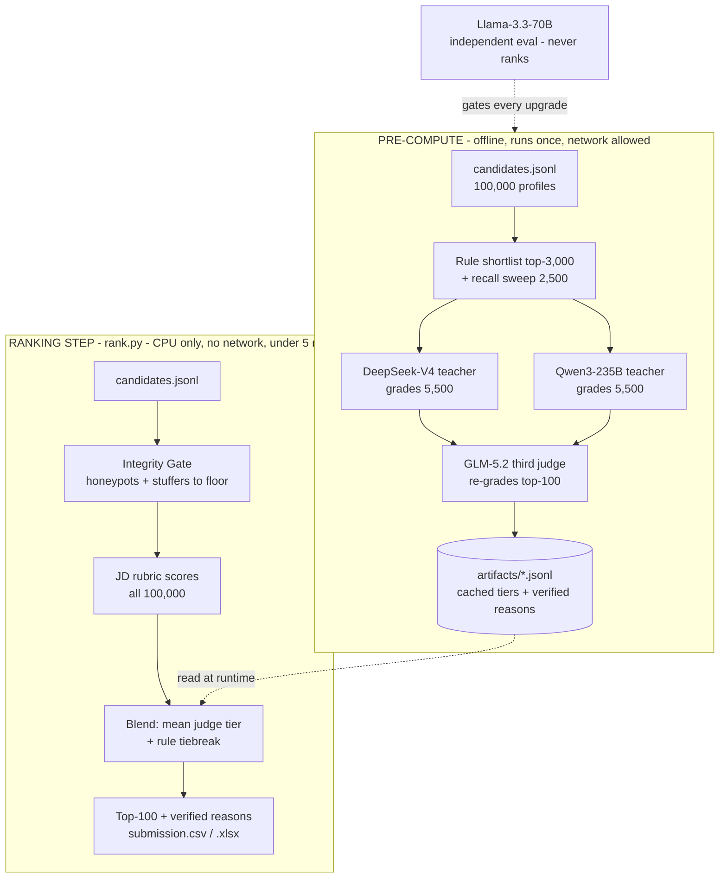

# Parakh

> **परख** (*parakh*) - to assay; to test whether gold is genuine.

A trap-aware candidate ranking system built for the **Redrob x India Runs - Data & AI Challenge**: rank the top-100 best-fit candidates for a Senior AI Engineer role out of a pool of 100,000 profiles.

Parakh does not match keywords. It **verifies every profile before trusting a word of it**, then ranks on evidence that survives: what the career narrative proves, what behavioral signals confirm, and what three independent AI model families agree on.

**Team Evolve** - Rayyan Ahmed Shaikh (lead), Inchara P, Harshita Nagesh

| | |
|---|---|
| Ranked output | `Parakh_top100.csv` / `Parakh_top100.xlsx` (passes the official validator) |
| Live sandbox | [huggingface.co/spaces/TheClazer/parakh-ranker](https://huggingface.co/spaces/TheClazer/parakh-ranker) |
| Reproduce | `python rank.py --candidates candidates.jsonl --out submission.csv` |

---

## Results

Evaluated by an independent model (Llama-3.3-70B) that plays no role in the ranking itself:

| System version | NDCG@10 | Tier-5 in top-10 |
|---|---|---|
| Rule rubric only | 0.64 | 5 / 10 |
| + LLM teacher | 0.88 | 8 / 10 |
| + multi-judge ensemble (final) | **1.00** | **10 / 10 - unanimous across 3 model families** |

- **0 honeypots and 0 keyword-stuffers** in the final top-100 (the challenge disqualifies submissions above 10% honeypots)
- **9 hidden gems** recovered by a full-pool recall sweep that the rule shortlist had under-ranked
- **95 / 100** final justifications pass strict programmatic fact-verification against the source profiles
- **Byte-identical reproduction**: the bare reproduce command regenerates the submitted CSV exactly
- Runtime self-test on every run: **~180-265 s wall** (limit 300), **0.21 GB RAM** (limit 16), CPU-only, zero network

An honest caveat: judge agreement is a strong proxy, not the organizers' hidden ground truth. We report what we can measure.

## Why the obvious approach loses here

We audited all 100,000 profiles before writing the ranker. The dataset is engineered to defeat "embed everything, cosine, sort":

- **The skills array is what stuffers stuff.** Genuine ML engineers average 3.78 AI-core skills; non-technical profiles average 0.62 - yet the worst keyword-stuffers carry up to 12. Counting keywords ranks the fakes first.
- **The signal lives in the narrative.** 7,334 candidates describe real retrieval / ranking / recommendation work under a non-ML job title. Title and keyword filters miss every one of them.
- **The planted honeypots have detectable signatures**: "expert" proficiency in skills used for 0 months, and job tenure longer than the entire career. Our gate hard-flags these outright; the judges bury the remainder.
- Embedding similarity makes it worse, not better: stuffed profiles sit close to the JD in vector space precisely because they copied its vocabulary. Semantic similarity scores the disguise, not the work.

## Architecture

Two planes. All intelligence is pre-computed once, offline; the submitted ranking step reads cached artifacts and runs in minutes on a laptop CPU with no network - exactly as the challenge's compute constraints require ("plan for a small ranker over precomputed features").



### Ranking step (`rank.py` - the submitted artifact)

1. **Integrity Gate** (`parakh/integrity.py`) - rejects impossible profiles (expert-skill-with-0-months, tenure exceeding the career, contradictory dates) and keyword-stuffers (AI skill lists with no supporting career narrative). Flagged profiles can never reach the top-100. We also document a check we deliberately rejected - last-active-before-signup fires on 7,496 profiles of generator noise. Precision over recall: a false honeypot flag buries a real candidate.
2. **Transparent JD rubric** (`parakh/features.py`, `parakh/score.py`) - scores all 100,000 on role fit, narrative evidence of building retrieval / ranking / recommendation systems, must-have signals (embeddings, vector databases, ranking evaluation), experience band, product-vs-services history, location, and a behavioral-availability multiplier built from the 23 platform signals.
3. **Judgment blend** - final score = mean judge tier (0-5) + rule score as the within-tier tiebreak, scaled to [0,1]. Ties break by candidate_id ascending, per the specification.
4. **Verified reasoning** - each of the 100 rows carries a justification generated from the profile JSON and programmatically checked for hallucinated skills or employers, with tone matched to rank: low ranks lead with the honest concern.

### Pre-compute (offline; network and heavy models allowed)

| Stage | Script | What it does |
|---|---|---|
| Teacher grading | `precompute.py` | DeepSeek-V4 and Qwen3-235B (via Nebius Token Factory) each grade ~5,500 candidates on a JD rubric: the rule-shortlist top-3,000 plus a sweep |
| Recall rescue | `sweep.py` | Scans the full 100k for narrative evidence the rules under-ranked, so no plain-language gem is invisible to the teachers |
| Third judge | `regrade.py` | GLM-5.2 (a third model family) re-grades the top-100; the top-10 is unanimous tier-5 across all three families |
| Reason verification | `reason_polish.py` | Regenerates and fact-checks every final justification |
| Independent eval | `eval.py` | Llama-3.3-70B scores any candidate ranking; every architecture layer had to prove a top-10 gain before it shipped |

All outputs are cached as JSONL artifacts in `artifacts/` and committed, so Stage-3 reproduction needs no network and no model access.

## Reproduce

```bash
pip install -r requirements.txt
python rank.py --candidates ./candidates.jsonl --out ./submission.csv --xlsx ./submission.xlsx
```

Runs offline on CPU in about 3 minutes and prints a compliance self-test (wall time, peak RAM). Validate with the organizer's checker:

```bash
python validate_submission.py submission.csv   # -> "Submission is valid."
```

The Hugging Face Space runs the same code path on uploaded samples of up to 100 candidates.

## Repository layout

```
rank.py                     ranking step - the submitted artifact (offline, CPU)
parakh/config.py            JD-derived vocabulary and scoring weights (auditable)
parakh/integrity.py         Integrity Gate: honeypot and stuffer detection
parakh/features.py          per-candidate feature extraction
parakh/score.py             rubric scoring and fallback reasoning
precompute.py               offline teacher grading (Nebius)
sweep.py                    full-pool recall rescue
regrade.py                  third-judge re-grading
reason_polish.py            fact-verified reasoning generation
eval.py                     independent evaluation harness
app.py                      Gradio sandbox (Hugging Face Space)
artifacts/*.jsonl           cached judge tiers and verified reasons
Parakh_top100.csv / .xlsx   the frozen submission
submission_metadata.yaml    submission metadata
deck/Parakh_official.pdf    approach deck (official template)
```

## Design notes

- **Why not a learned ranker over embeddings?** The dataset ships no labels; any learned ranker must first bootstrap a supervision signal, which is exactly what the offline teachers produce. We spent the budget making that judgment reliable (three model families) instead of hiding it inside a trained model. Embedding retrieval remains the natural recall layer at 200k+ scale - underneath the same gate and judges, not instead of them.
- **Why multiple judges?** Different model families make different mistakes. DeepSeek is harsher than Qwen; GLM breaks their ties. Requiring cross-family agreement at the top cancels any single model's overconfidence.
- **Why is the ranking step so plain?** Because the constraints demand it and production would too: frontier judgment where it is cheap (offline, batched, cached), deterministic simplicity where it must be fast, auditable, and reproducible.
